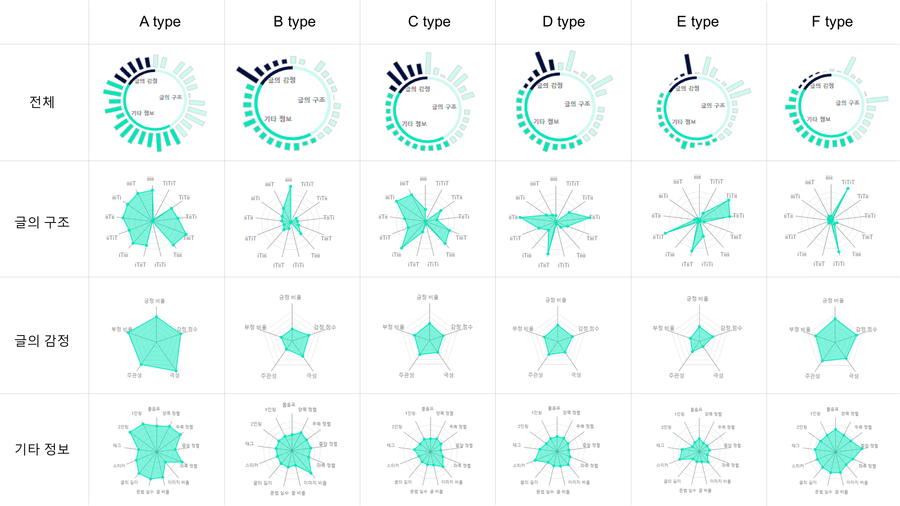

# 사다리 v1.0

## 사다리 소개
네이버 웨일 확장앱 콘테스트 본선 진출작으로, 네이버 블로그에 대한 신뢰성 판단을 지원하는 어플리케이션입니다.
  
__주요 기능__ 
 * 네이버 블로그를 대상으로, 신뢰성 판단 결과를 사용자에게 알람으로 제공합니다.
 * 알람을 누르면 사이드바가 열리며, 결과에 대한 자세한 분석기능(블로그 특징, 감정단어 분석, 시각화)을 제공합니다.
 * A. 일반 유저인지, B. 블로그 체험단을 통하여 작성된 글인지, C. 원고만 받고 쓴 글인지에 대한 정보도 함께 제공합니다. 
 
 ## 팀 구성원

*	__조용걸__ [아주대학교 데이터사이언스학과  _yonggeol93@ajou.ac.kr_]
* __전승곤__ [아주대학교 컴퓨터공학과  _vskylife5901@ajou.ac.kr_] 
* __한재호__ [아주대학교 미디어학과  _woghrnt2@ajou.ac.kr_]

*	__Adviser__ 
    *	__한경식__ [아주대학교 컴퓨터공학과/데이터사이언스학과 _kyungsikhan@ajou.ac.kr_]
    
*	__Thanks to__ 
    *	__한현우__ [아주대학교 미디어학과]
    *	__도은혜__ [아주대학교 미디어학과]
    
    
## 주요 내용

__신뢰성의 정의__  
신뢰성에 대한 정의는 '해당 분야의 지식을 갖춘 사용자의 솔직한 의견이 담겨있는글'을 신뢰있는 글로 보았고, 반대로 '특정 분야의 경험과 전문적인 지식을 가지고 있지 않은 사용자의 글'을 신뢰성이 떨어지는 글로 정의하였습니다[1]. 따라서, 직접 체험을 바탕으로 작성한 글 혹은 전문성을 가진 저자가 작성한 글을 신뢰성이 있는 글로 정의하였고, 경험 없이 원고를 받고 작성한 글을 신뢰성이 없는 글로 정의하였습니다.

__모델 구성__ 

18개 분야(맛집, 국내여행, 뷰티 등)의 16,304개 블로그를 이용하여 학습된 딥러닝 모델(MLP - 4 hidden layer)이 사용되었으며[2], 모델 결과에 대한 설명력을 높이기 위해
K-means 군집화 방법을 추가하였습니다[3]. 아래는 모델에 사용된 31개 feature 입니다[4-14]. 
 

## 블로그 분류 6가지 타입
블로그를 6가지 타입으로 나눈 것은, 머신러닝 모델에 대한 결과를 해석하기 위해 K-means clustering방법을 사용하여 나누었습니다.
신뢰성이 높은 블로그와 신뢰성이 떨어지는 블로그의 집단 내 비중을 통해서, '어떤 집단의 값의 특징들이 신뢰성이 높은 블로그들이 가지고 있는 특징이다'를 해석할 수 있습니다.
현재, v1사다리는 사용자에게 머신러닝 결과와 혼동의 여부를 줄 수 있어, 신뢰성이 있는 블로그가 많이 포함되어있는 집단 / 신뢰성이 떨어지는 블로그가 많이 포함되어있는 집단으로 나누지는 않고, A~F type의 블로그로 나누어 결과를 제시합니다.

  

## 관련 논문

*	[1] Fogg, B. J., & Tseng, H.(1999). The elements of computer credibility. _In Proceddings of the SIGCHI conference on Human Factors in Computing Systems_(pp.80-87). ACM
*	[2] How Do Humans Assess the Credibility of Weblogs: Qualifying and Verifying Human Factors with Machine Learning _SIGCHI_ (under review).
*	[3] 기계학습 기반 블로그 신뢰도 시각화 웹 어플리케이션 개발: Visualization Web Application Development Based on Machine learning for Credibility of Weblogs _KHCI_ (under review).
*	[4] Mukherjee, A., Venkataraman, V., Liu, B., & Glance, N. S. (2013, July). What yelp fake review filter might be doing?. In ICWSM (pp. 409-418).
*	[5] Benevenuto, F., Magno, G., Rodrigues, T., & Almeida, V. (2010, July). Detecting spammers on twitter. In Collaboration, electronic messaging, anti-abuse and spam conference (CEAS) (Vol. 6, No. 2010, p. 12).
*	[6] Castillo, C., Mendoza, M., & Poblete, B. (2011, March). Information credibility on twitter. In Proceedings of the 20th international conference on World wide web (pp. 675-684). ACM.
*	[7] Ferrara, E., Varol, O., Davis, C., Menczer, F., & Flammini, A. (2016). The rise of social bots. Communications of the ACM, 59(7), 96-104.
*	[8] Han, K. (2018). How do you perceive this author? Understanding and modeling authors’ communication quality in social media. PloS one, 13(2), e0192061.
*	[9] Lee, K., Caverlee, J., & Webb, S. (2010, July). Uncovering social spammers: social honeypots+ machine learning. In Proceedings of the 33rd international ACM SIGIR conference on Research and development in information retrieval (pp. 435-442). ACM. 
*	[10] Li, F., Huang, M., Yang, Y., & Zhu, X. (2011, July). Learning to identify review spam. In IJCAI Proceedings-International Joint Conference on Artificial Intelligence (Vol. 22, No. 3, p. 2488).
*	[11] Lu, Y., Zhang, L., Xiao, Y., & Li, Y. (2013, May). Simultaneously detecting fake reviews and review spammers using factor graph model. In Proceedings of the 5th annual ACM web science conference (pp. 225-233). ACM.
*	[12] Stringhini, G., Kruegel, C., & Vigna, G. (2010, December). Detecting spammers on social networks. In Proceedings of the 26th annual computer security applications conference (pp. 1-9). ACM.
*	[13] 소현진. (2013). 신뢰받는 블로그 콘텐츠의 특성 탐구: 파워블로그의 사용후기분석과 소비자 조사를 통하여. 한국콘텐츠학회논문지, 13(1), 73-82.
*	[14] 장재영, 이병준, 조세진, 한다혜, & 이규홍. (2016). 기계학습기법을 이용한 광고 외식 블로그의 자동분류. 한국인터넷방송통신학회 논문지, 16(2), 55-62.
